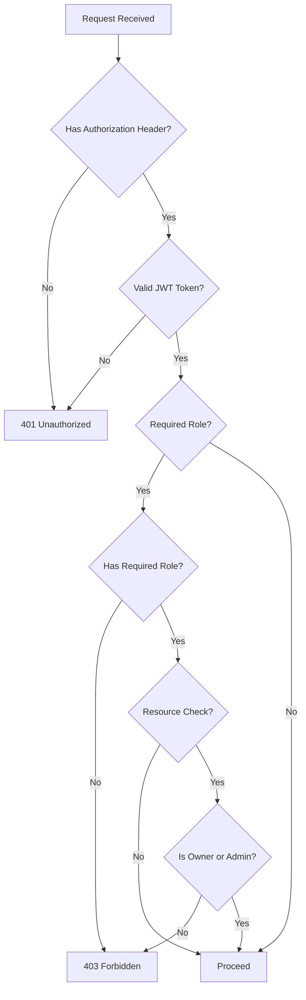

# Data Model: Keycloak REST API Authorization

**Feature Branch**: `011-keycloak-api-auth`  
**Date**: 2025-12-21  
**Spec**: [spec.md](file:///Users/emanuelcerqueira/Documents/rag-saas/specs/011-keycloak-api-auth/spec.md)

## Overview

This document defines the data model additions required to support Keycloak-based authorization in the RAG-SaaS platform. The primary change is adding ownership tracking to the `Project` entity.

---

## Entity Changes

### Project (Modified)

The existing `Project` entity requires a new field to track ownership.

```java
@Entity
@Table(name = "projects", schema = "rag")
public class Project {
    // Existing fields
    @Id
    private UUID id;
    
    @Column(nullable = false)
    private String name;
    
    @CreationTimestamp
    private LocalDateTime createdAt;
    
    @UpdateTimestamp
    private LocalDateTime updatedAt;
    
    // NEW: Owner tracking for authorization
    @Column(name = "owner_id", length = 255)
    private String ownerId;  // Keycloak subject ID (sub claim)
}
```

**Field Details**:

| Field | Type | Nullable | Description |
|-------|------|----------|-------------|
| `owner_id` | VARCHAR(255) | YES | Keycloak subject ID (`sub` claim) of the project creator. Nullable for backward compatibility with existing projects. |

**Constraints**:
- No foreign key (Keycloak manages users externally)
- Index recommended for authorization queries: `CREATE INDEX idx_projects_owner_id ON rag.projects(owner_id);`

---

## Database Migration

### Migration Script: `V1.1__add_project_ownership.sql`

```sql
-- Add owner_id column to projects table
ALTER TABLE rag.projects 
ADD COLUMN owner_id VARCHAR(255);

-- Add index for authorization queries
CREATE INDEX idx_projects_owner_id ON rag.projects(owner_id);

-- Comment for documentation
COMMENT ON COLUMN rag.projects.owner_id IS 'Keycloak subject ID (sub claim) of the project creator. NULL for legacy projects.';
```

### Rollback Script

```sql
-- Remove owner_id column
DROP INDEX IF EXISTS rag.idx_projects_owner_id;
ALTER TABLE rag.projects DROP COLUMN owner_id;
```

---

## Security Principal Representation

### SecurityIdentity (Quarkus Provided)

Quarkus OIDC provides `io.quarkus.security.identity.SecurityIdentity` automatically. Key methods:

```java
@Inject
SecurityIdentity securityIdentity;

// Get Keycloak subject ID (user identifier)
String userId = securityIdentity.getPrincipal().getName();

// Check roles
boolean isAdmin = securityIdentity.hasRole("admin");
boolean isUser = securityIdentity.hasRole("user");

// Get all roles
Set<String> roles = securityIdentity.getRoles();
```

### JWT Claims Access (Optional)

For additional claims (username, email, etc.):

```java
@Inject
JsonWebToken jwt;

String subject = jwt.getSubject();  // Same as principal name
String preferredUsername = jwt.getClaim("preferred_username");
String email = jwt.getClaim("email");
```

---

## Authorization Decision Model

### Endpoint Authorization Flow



### Role Hierarchy

| Role | Permissions |
|------|-------------|
| `admin` | Full access to all resources |
| `user` | Create projects, access/modify own projects only |
| *(no role)* | Authenticated but no access (403) |

### Endpoint-to-Role Mapping

| Endpoint | Method | Minimum Role | Resource Check |
|----------|--------|--------------|----------------|
| `POST /projects` | Create | `user` | No |
| `GET /projects` | List | `user` | Filter by owner (users see own only) |
| `GET /projects/{id}` | Read | `user` | Owner or admin |
| `PUT /projects/{id}` | Update | `user` | Owner or admin |
| `DELETE /projects/{id}` | Delete | `user` | Owner or admin |
| `POST /documents/*` | Create | `user` | Project owner or admin |
| `GET /documents/*` | Read | `user` | Project owner or admin |
| `DELETE /documents/*` | Delete | `user` | Project owner or admin |
| `POST /chat` | Query | `user` | Project owner or admin |
| `GET /q/health/*` | Health | *(public)* | No |
| `GET /openapi` | Docs | *(public)* | No |
| `GET /swagger-ui/*` | Docs | *(public)* | No |

---

## Keycloak Configuration Model

### Realm: `rag-saas`

```yaml
realm: rag-saas
enabled: true
registrationAllowed: false
loginWithEmailAllowed: true
duplicateEmailsAllowed: false
```

### Client: `rag-saas-api`

```yaml
clientId: rag-saas-api
enabled: true
protocol: openid-connect
publicClient: false
standardFlowEnabled: false      # Not needed for API
directAccessGrantsEnabled: true # Allows password grant for testing
serviceAccountsEnabled: false
authorizationServicesEnabled: false
```

### Roles

```yaml
roles:
  realm:
    - name: user
      description: Standard user with access to own projects
    - name: admin
      description: Administrator with full access to all resources
```

### Default Users (Development Only)

| Username | Password | Roles |
|----------|----------|-------|
| `testuser` | `testuser` | `user` |
| `testadmin` | `testadmin` | `user`, `admin` |

---

## Validation Rules

### Project Ownership Validation

```java
public void validateProjectAccess(UUID projectId, SecurityIdentity identity) {
    Project project = projectRepository.findById(projectId)
        .orElseThrow(() -> new NotFoundException("Project not found"));
    
    String userId = identity.getPrincipal().getName();
    boolean isAdmin = identity.hasRole("admin");
    boolean isOwner = userId.equals(project.getOwnerId());
    
    if (!isAdmin && !isOwner) {
        throw new ForbiddenException("Access denied to project");
    }
}
```

### Legacy Project Handling

Projects with `owner_id = NULL` (created before this feature):
- **Read**: Allowed for all authenticated users
- **Modify/Delete**: Allowed only for `admin` role
